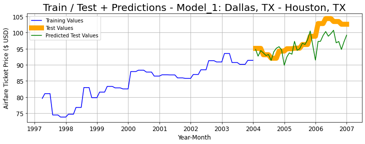

# Forecasting Airfare Prices
  
**01** [Problem Statement](#01-Problem-Statement)  
**02** [Data Collection and Cleaning](#02-Data-Collection-and-Cleaning)  
**03** [EDA & Pre-Processing / Feature Engineering](#03-EDA-and-Pre-Processing-/-Feature-Engineering)  
**04** [Modeling / Feature Selection](#04-Modeling-/-Feature-Selection)  
**05** [Evaluation and Conceptual Understanding](#05-Evaluation-and-Conceptual-Understanding)  
**06** [Conclusion and Recommendations](#06-Conclusion-and-Recommendations)

## Project Map
-[README](https://github.com/tluccini/predicting_airfare_prices/blob/main/README.md)  
-[Presentation Deck](https://github.com/tluccini/predicting_airfare_prices/blob/main/presentationdeck_predictingairfareprices.pdf)  
-[1 Summary](https://github.com/tluccini/predicting_airfare_prices/blob/main/01_summary.ipynb)  
-[2 Data Collection](https://github.com/tluccini/predicting_airfare_prices/blob/main/02_datacollection.ipynb)  
-[3 EDA & Pre-processing](https://github.com/tluccini/predicting_airfare_prices/blob/main/03_eda_preprocess.ipynb)  
-[4 Modeling / Feature Selection & Conclusion](https://github.com/tluccini/predicting_airfare_prices/blob/main/04_model_featselect.ipynb)  
-[visualizations](https://github.com/tluccini/predicting_airfare_prices/tree/main/visualizations)  
-[data](https://drive.google.com/drive/folders/1UDfDAi82n2gFF2umzAXXmreaTvKMY3lF?usp=sharing) (for data access reach out to tonylucci@gmail.com)  

**DATA DICTIONARY**
| variable| Description |
| :--- | :---- |
| **airfare** | The average flight cost for one individual |
| **cost_per_mile** | The average flight cost x total passengers / flight distance |
| **dest_lat** | The flight destination latitude |
| **dest_long** | The flight destination longitude |
| **dist_miles** | The distance of the flight |
| **flight_demand** | The total passengers / total seats available |
| **flight_revenue** | The average flight cost x total passengers |
| **fuel_usd_pergallon** | The price of jet fuel |
| **num_of_flights** | The total number of flights |
| **origin_lat** | The flight origin latitude |
| **origin_long** | The flight origin longitude |
| **passengers** | The total number of passengers |
| **passengers_per_flight** | The total number of passengers / total number of flights |
| **pop_dest** | The population of the destination city |
| **pop_origin** | The population of the origin city |
| **route** | The itinerary (origin city to destination city |
| **seat_capacity** | The total number of seats |
| **total_flight_cost** | The number of flights x flight distance x price of jet fuel |
| **total_flight_miles** | The number of flights x flight distance |
| **year-month** | The time series data to be set as the index |

# **01** Problem Statement

### Problem & Goal
###### **PREDICTING FUTURE PLANE PRICES BY MARKET/ROUTE & MONTH (USA)**

The price airfare is a very interesting topic.  There are countless times in my life I decided to book travel only to look to see the cost of the flight was beyond my budget.  Predicting the cost of airfare is a significant undertaking that I suspect a lot of traveling individuals would be interested in.  Of course you know the price of the flight when you book it, but wouldn't it be cool and highly beneficial to know ahead of time what the cost of the flight will be at a specific date in the future?  If you did know that you may be inclined to continue procrastinating or in fact pull the trigger asap as you know you have found yourself a deal.

This project sets out to predict airfare pricing so that individuals are well equipped when searching for airfare and they will be empowered to make a decision quicker based on a comparison of a price quote they find online vs. what our models predict will be the airfare cost.

###### **METHODS / MODELS**
- Linear Time Series Modeling
- Seasonal / ARIMA Modeling

###### **EVALUATION**
- Predicting Future Airline Prices by Market / Month
- Evaluate Models using R2 and RMSE scores

# **02** Data Collection and Cleaning

### Data Collection
###### **Sources**
- [**Historical Jet Fuel Prices**](https://www.eia.gov/opendata/qb.php?sdid=PET.EER_EPJK_PF4_RGC_DPG.M) 
    - Data showcases the price of Jet Fuel in US Dollars.
    - Data separated by month.
    - Data collected ranges from April 1990 to August 2020.
- [**Top 1,000 Contiguous State City-Pair Markets**](https://data.transportation.gov/Aviation/Consumer-Airfare-Report-Table-1-Top-1-000-Contiguo/4f3n-jbg2)
    - Data showcases the average airfare per route separated by origin and destination city for the 48 USA landlocked states.
    - Data separated by quarter.
    - Data collected ranges from Q1 1996 to Q3 2019.
- [**US Domestic Flights**](https://academictorrents.com/details/a2ccf94bbb4af222bf8e69dad60a68a29f310d9a)
    - Data showcases the airline flight data including route by city, route by airport, passengers, number of flights, total seats available, distance, and population.
    - Data separated by month.
    - Data collected ranges from January 1990 to December 2009.

### Data Cleaning / Merging
- Clean 
    - Historical Jet Fuel Prices
        - Saved as variable 'fuel'
        - DatetimeIndex created
    - Top 1,000 Contiguous State City-Pair Markets
        - Saved as variable 'airfare'
        - DatetimeIndex created
        - Identify matching routes
        - Changed city names to match city names from different dataset
    - US Domestic Flights
        - Saved as variable 'flights'
        - DatetimeIndex created  
- Merge
    - Combine US Domestic Flights (left) & Top 1,000 Contiguous State City-Pair Markets.
    - Left join on route, quarter, and year to preserve shape of US Domestic Flights.
        - **Imputation:** airfare route pricing data was gathered on a quarterly basis, therefore the same value was imputed for each month of the corresponding quarter.
    - Resulting dataframe contain 381 different routes over 168 months.
        - Dataset is by month and ranges from the beginning of 1996 to end of 2009.

# **03** EDA and Pre-Processing / Feature Engineering

### Datasets
- We will be working with 3 datasets to begin which include:
    - df_combined: This includes all of our data (1996-2009)
    - df_train: This includes our df_combined dataset split into a training dataset (1996-2006)
    - df_test: This is going to our dataset of unseen data for which we will test how good our model actually is (2007-2009)
    
### Visualize Data
- Let's determine the top route by passenger volume over the life of our data as a baseline model
- Visualize Route Data Upon selection of this route we dive into EDA and visualize the route data
    - Lineplots
    - Decomposition Plots

### Pre-Processing / Feature Engineering
- Feature Engineering
    - General Features
- ACF & PACF Plots    
    - Trend / Seasonal Features
- Pre-Processing
    - AdFuller Test on each dataseries in our dataframes
    - Engineer features with stationary data

# **04** Modeling / Feature Selection
Building out a way to evaluate multiple models where we can evaluate them objectively

### OLS
- Build multiple OLS (Original Least Squares) linear regression models with optimal features on one route (1996-2006)
    - Analyze Statsmodel Summary and ensure features fall below a 5% threshold for pvalue
    - Iteration: Remove features & retest new model (machine learning)
- Apply our best model on all routes (1996-2006)
- Apply our best model on unseen data for each route (2007-2009)

### ARIMA
- Build out an ARIMA model to compare to an OLS model's performance

# **05** Evaluation and Conceptual Understanding
- Looking into our results inference will be provided as to our findings to determine what drives model's best performance
- Here is a visualization of one of the routes:

- Each model will be plotted and all relevant information will be saved into a dicitonary
- Our All Routes Dictionary will include for each route
    - Route Dataframe for training / testing
    - Test (Unseen) Dataframe for testing our OLS model on unseen data
    - Potential Features (will vary by route, as a byproduct of AdFuller stationary requirements for time series modeling)
    - Embedded dictionary of model analytics - 
        - Each route had multiple models starting with model 1 and reducing by one feature for each additional model until our p-value requirement of 0.05 or less was satisfied
        - Analytics include R2 & RMSE for training data, testing data, unseen data, and the baseline scores for reference
    - Final Model
    - Final Features

- For additional detail regarding evaluation and conceptul understanding you will encounter much greater detail within notebook 03 & 04
---------------------------------------------------------------------------------------------------------------------------------------

# **06** Conclusion and Recommendations

## **WINS**

- We succeeded in building 63 separate route specific that predicted R2 scores between 90-100% out of 375 total routes examined.

- From this we can be confident to tell an individual that when they are searching for a flight, they should cross reference their findings with our prediction model.  Of course it will be up to them, but they will be empowered to make a decision whether to buy this flight now, or wait until a future date dependent on their own personal budget.

- We succeed in improving RMSE scores 21.85% on 299 of our 375 total routes.  From starting with an initial featureset and using machine learning to make feature selection based on specific conditions.

- 265 out of 375 of our test R2 scores outperformed the baseline scores

## **FUTURE THOUGHTS**

- As we knew predicting airling pricing is a very tricky task.  Ensuring we get as much granular information as possible can be a next step to further building out this project and finding patterns to build more effective models.

- Given more time I would look to scrape the web for pricing information for flights perhaps down to the daily / Hourly level.  So much goes into airpline pricing and as we all know the time of the purchase really makes a difference.

- We'd love to build a web app where individuals can plug their price quote into it that will let them know how much savings they will make by booking the flight now, and, perhaps, show them where we seee the price going over the next 3 months so they create urgency in themselves for making the purchase.

## Contact Information

- Name: Tony M. Lucci
- e-mail: tonylucci@gmail.com
- phone: +1 (717) 926 1534